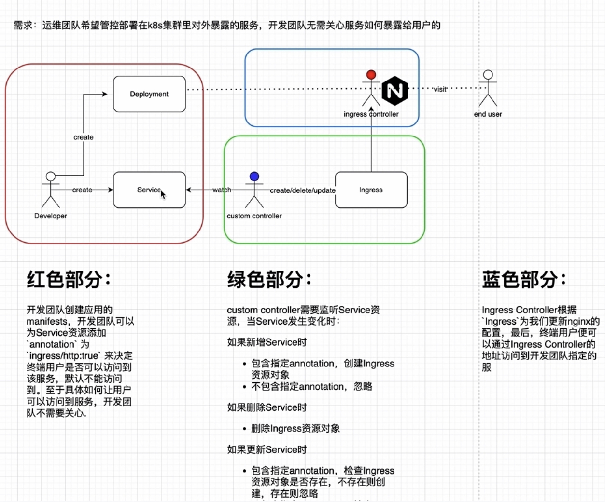

# 一、operator原理

- Reflector：Refelctor从apiserver监听（watch）特定类型的资源，拿到变更通知后，将其丢到DeltaFIFO队列中。
- Informer：informer从DeltaFIFO中弹出（pop）相应对象，然后通过indexer将对象和索引丢到本地cache中
- indexer：indexer主要提供一个对象根据一定条件检索的能力，典型的实现是通过namespace/name来构造key，通过thread safe store来存储对象
- WorkerQueue:WorkQueue一般使用的是延时队列实现，在Resource Event Handlers中会完成将对象的key放入WorkQueue的过程，然后在自己的逻辑代码里从WorkerQueue中消费这些key
- ClientSet：ClientSet提供的是资源的CURD能力，与apiserver交互。
- Resource Event Handlers：我们一般在Resource event Handlers中添加一些简单的过滤功能，判断哪些对象要加到 workerqueue中进一步处理，对于需要加到workqueue中的对象，就提取其key，然后入队。
- Worker：Worker指的是我们自己的业务代码处理过程，在这里可以直接收到workerqueue中的任务，可以通过indexer从本地缓存检索对象，通过clientset实现对象的增删添改。
## 1.1 reflector
在Operator中，Reflector是一个常用的工具，用于从Kubernetes API服务器中获取资源对象的变更事件并进行监听。它的主要作用是实时地将资源对象的状态同步到Operator的内存中，以便Operator能够对资源对象进行相应的处理和控制。

具体而言，Reflector可以执行以下功能：

1. 初始同步：在启动时，Reflector会从Kubernetes API服务器获取所有的资源对象，并将它们同步到Operator的内存中，构建资源对象的本地缓存。

2. 增量同步：Reflector会持续监听Kubernetes API服务器的变更事件，如新增、更新、删除等操作。一旦有变更事件发生，Reflector会及时接收到通知，并将变更的资源对象同步到Operator的内存中，保持本地缓存的最新状态。

3. 过滤和选择：Reflector可以根据配置的过滤规则和选择器来筛选出感兴趣的资源对象。这样可以减少不必要的网络传输和资源消耗，提高效率。

4. 缓存管理：Reflector会管理资源对象的本地缓存，包括对象的增加、更新、删除等操作。它负责保证缓存的一致性和正确性，并提供查询接口供Operator使用。

通过使用Reflector，Operator可以方便地获取Kubernetes集群中的资源对象，并根据其变更事件来触发相应的操作。这样可以实现实时的资源同步和状态控制，使Operator能够快速、准确地响应集群中资源对象的变化。
### 1.1.1 reflector创建
```go
func NewReflector(lw ListerWatcher, expectedType interface{}, store Store, resyncPeriod time.Duration) *Reflector {
	return NewReflectorWithOptions(lw, expectedType, store, ReflectorOptions{ResyncPeriod: resyncPeriod})
}
```
这是一个函数签名，它定义了一个名为`NewReflector`的函数，用于创建一个`Reflector`对象。让我们逐个解析函数的参数和返回值的含义：

- `lw ListerWatcher`：这是一个实现了`ListerWatcher`接口的对象，用于从Kubernetes API服务器获取资源对象的列表和监视事件。

- `expectedType interface{}`：这是期望的资源对象类型。它是一个空接口，可以接受任何类型的资源对象。在`Reflector`中，它用于指定所要处理的资源对象类型。

- `store Store`：这是一个实现了`Store`接口的对象，用于存储和管理从API服务器获取的资源对象。

- `resyncPeriod time.Duration`：这是一个时间段，表示`Reflector`的重新同步周期。它定义了多久需要对资源对象进行一次完整的同步，以确保与API服务器中的状态保持一致。

- 返回值：返回一个指向`Reflector`对象的指针。

该函数的作用是创建一个`Reflector`对象，并根据传入的参数初始化对象的各个字段。`Reflector`是Kubernetes客户端库中的一部分，它提供了资源对象的列表和事件的自动同步机制。通过创建`Reflector`对象并传入合适的参数，可以实现对指定类型资源对象的列表和事件的监视和同步操作。
### 1.1.2 List和Watch
- List: 指定类型资源对象的全量更新。并将其更新到缓存中
    curl -iv http://127.0.0.1:8001/api/v1/namespaces/default/pods
- Watch: 指定类型资源对象的增量更新
    curl -iv http://127.0.0.1:8001/api/v1/namespaces/default/pods\?watch\=true
- ResourceVersion
    保证客户端数据的一致性、做并发控制
- Bookmarks
    减少API Server负载、更新客户端保存的最近一次ResourceVersion；
    "bookmark" 在 List-Watch API 中的作用是提供一个标记，以便客户端可以在重新连接时恢复     到之前的位置，从而继续监听资源的增量更新，而不必重新获取整个列表。
## 1.2 DeltaFIFO
"deltaFIFO" 是 Kubernetes 中一种用于处理增量资源更新的数据结构。它是一种队列（FIFO），用于管理对资源进行增量操作的事件。

在 Kubernetes 中，当使用 List-Watch API 监视资源时，API 服务器会定期向客户端发送增量更新，即资源的变化事件。这些事件可能包括创建、更新或删除资源的操作。deltaFIFO 就是用来存储这些增量事件的队列。

deltaFIFO 的主要功能是接收和处理增量事件，以便在客户端需要时提供正确的资源状态。它会按照事件的顺序将其放入队列中，并且可以按照先进先出的原则从队列中取出事件。

使用 deltaFIFO 可以确保客户端按照正确的顺序处理资源的变化，并避免因并发操作导致的不一致性。它还提供了一种缓冲机制，使客户端能够在需要时获取最新的资源状态，而不必频繁地查询 API 服务器。

总结来说，deltaFIFO 是 Kubernetes 中用于管理增量资源更新的队列数据结构，它能够按照顺序接收和处理资源的变化事件，并提供缓冲机制以供客户端获取最新的资源状态。

### 1.2.1 Store的类型
通过实现 Store 接口，可以创建不同类型的存储机制，以满足特定的需求。
- cache：实现Store，利用threadSafeMap存放数据
- UndeltaStore:实现Store，利用cache存放数据，数据变更时通过PushFunc发送当前完整状态
- FIFO：实现Queue（包含Store），利用自己内部的items数据结构存放数据
- DeltaFIFO：
- Heap：实现Store，利用data数据结构存放数据，实现堆数据结构，用于优先级队列
- ExpirationCache：实现Store，利用threadSafeMap存放数据

## 1.3 indexer
在 Operator 开发中，Indexer 是用于高效索引和查询资源对象的数据结构或组件。它允许 Operator 在处理资源时根据自定义的索引标准进行快速的数据查找和过滤操作，提高了操作效率和性能。

Indexer 的主要作用包括：

1. **提供快速的数据查找**：Indexer 可以根据指定的索引标准对资源对象进行索引，使得在需要查找某个或某些资源对象时能够快速找到目标对象，而无需遍历整个资源列表。

2. **支持按条件过滤资源**：通过创建合适的索引，Indexer 可以支持按条件过滤资源，只返回满足特定条件的资源对象，从而减少不必要的数据处理和传输。

3. **支持多种索引策略**：Indexer 提供了多种索引策略，如哈希索引、有序索引等，可以根据不同的需求选择适合的索引方式。这样可以根据具体的业务场景和查询需求来优化索引性能。

4. **实现资源间的关联查询**：Indexer 可以支持资源之间的关联查询，即根据某个资源对象的特定属性值快速查找与之相关联的其他资源对象。这在处理资源之间的依赖关系或关联关系时非常有用。

5. **提供数据一致性和并发安全性**：Indexer 在更新资源对象时会维护索引的一致性，并提供并发访问的安全性，确保在多线程或多协程环境下的数据操作正确且线程安全。

通过使用 Indexer，Operator 可以更高效地处理和管理 Kubernetes 资源对象，提高操作的效率和性能。它使得资源的查找、过滤和关联查询变得更加灵活和高效，为 Operator 的业务逻辑和功能提供了强大的支持。

cache委托threadSafeMap存放数据
```go
type Indexer interface {
	Store
	// Index returns the stored objects whose set of indexed values
	// intersects the set of indexed values of the given object, for
	// the named index
	Index(indexName string, obj interface{}) ([]interface{}, error)
	// IndexKeys returns the storage keys of the stored objects whose
	// set of indexed values for the named index includes the given
	// indexed value
	IndexKeys(indexName, indexedValue string) ([]string, error)
	// ListIndexFuncValues returns all the indexed values of the given index
	ListIndexFuncValues(indexName string) []string
	// ByIndex returns the stored objects whose set of indexed values
	// for the named index includes the given indexed value
	ByIndex(indexName, indexedValue string) ([]interface{}, error)
	// GetIndexers return the indexers
	GetIndexers() Indexers

	// AddIndexers adds more indexers to this store.  If you call this after you already have data
	// in the store, the results are undefined.
	AddIndexers(newIndexers Indexers) error
}
```
## 1.4 thread-safe-store
Thread-safe Store（线程安全的存储）是一种数据结构或组件，用于在多线程或并发环境下安全地存储和操作数据。它的主要作用是保证数据的一致性和线程安全性，防止多个线程同时读取和写入数据时出现竞态条件（race condition）和数据不一致的情况。

在 Operator 开发中，Thread-safe Store 的作用包括：

1. **并发读写操作的安全性**：在多线程或并发环境下，多个线程可能同时读取和写入存储的数据。Thread-safe Store 提供了线程安全的读写操作，保证数据的一致性，防止数据损坏或不一致的情况发生。

2. **保护共享资源的访问**：在多线程环境下，多个线程可能同时访问和修改共享的资源，如共享的数据结构或全局变量。Thread-safe Store 提供了同步机制，确保每个线程的访问按序进行，避免资源竞争和冲突，保证数据的正确性。

3. **支持并发查询和更新**：Thread-safe Store 允许多个线程同时进行读取和更新操作，提高并发性能。它通过使用线程同步机制（如锁、互斥量等）来确保每个线程的操作不会相互干扰，从而提供高效的并发查询和更新功能。

4. **保证数据操作的原子性**：Thread-safe Store 提供了原子性操作，即对存储的数据进行复合操作时，操作要么完全执行成功，要么完全失败，保证数据的一致性和完整性。

通过使用 Thread-safe Store，Operator 可以在并发环境下安全地存储和操作数据，避免竞态条件和数据不一致的问题。它提供了线程安全的读写操作和同步机制，保证多线程或并发访问时数据的正确性和一致性，提高了程序的健壮性和并发性能。

## 1.5 Informer机制
> **Informer** 机制是 Kubernetes 客户端库中的一种机制，用于监听和缓存 Kubernetes API 资源的变化。它提供了一种实时获取和处理资源变更的能力，使开发者能够构建出具备自动化响应功能的应用程序或控制器。
简单理解：informer就是controller
在 Kubernetes 中，API Server 是集群中的控制平面组件，用于管理和存储集群中的各种资源对象，如 Pod、Service、Deployment 等。Informer 机制允许客户端应用程序通过订阅 API Server 的资源变更事件，实时获取资源对象的变化情况。

Informer 机制的工作流程如下：

1. 客户端应用程序创建一个 Informer 对象，并指定要监听的资源类型（如 Pod、Service）和对应的命名空间。
2. Informer 向 API Server 发送 List 请求，获取指定资源类型在指定命名空间中的初始列表。
3. Informer 开始通过 Watch 请求订阅资源的变更事件。API Server 将监听到的变更事件通过长连接推送给 Informer。
4. Informer 接收到资源变更事件后，会将变更的资源对象缓存在本地内存中。
5. 客户端应用程序可以通过注册回调函数或监听事件的方式，对缓存中的资源变更进行处理和响应。

使用 Informer 机制，客户端应用程序可以实时了解和响应 Kubernetes API 资源的变化。它提供了高性能、低延迟的数据访问和处理能力，对于构建基于 Kubernetes 资源的自动化应用程序或控制器非常有用。

> **SharedInformer** 是 Kubernetes 客户端库中的一种实现 Informer 机制的组件。它是对底层 Informer 的封装，简化了使用和管理 Informer 的过程，并提供了一些额外的功能。

- 1.缓存我们关注的资源对象的最新状态的数据，如创建indexer/clientset/deltafifo/controller
- 2.根据资源对象的变化事件来通知我们注册的事件处理方法，创建sharedprocessor/注册事件处理方法
ShareInformer的创建
- NewSharedIndexInformer
  创建informer的基本方法
- NewDeploymentInformer
  创建内建资源对象对应的informer的方法，调用NewSharedIndexInformer实现
- NewSharedInformerFactory
  工厂方法，内部有一个map存放我们创建过的informer，达到共享informer的目的，避免重复创建informer对象，浪费内存
  
## 1.6 WorkQueue
- 普通队列 Queue
- 延时队列 DelayingQueue
- 限速队列 RateLimitingQueue
在 Operator 中，Workqueue 扮演着关键的角色，它通常是实现控制器逻辑的核心组件之一。

作为一个通用的并发模式和任务调度工具，Workqueue 在 Operator 中用于处理各种异步任务。这些任务包括监听资源的变化、处理事件、执行调谐操作、与外部系统交互等。`Operator 的核心任务是观察和维护 Kubernetes 集群中的自定义资源，并根据预定义的规则和逻辑对集群进行管理和操作`。Workqueue 在其中扮演着协调和处理这些任务的重要角色。

具体来说，Workqueue 在 Operator 中的地位包括：

1. 事件监听和处理：Workqueue 可以通过监听 Kubernetes API Server 上的资源变化事件，如创建、更新、删除等，实时获取资源的最新状态。当有事件发生时，Workqueue 将事件转化为任务并放入队列中，等待后续的处理。

2. 调度和任务处理：Workqueue 负责调度队列中的任务，并将任务分发给后台的 worker 进行处理。它可以控制任务的执行顺序、并发度和速率，确保任务在适当的时间和方式下被执行。

3. 异常处理和重试：Workqueue 具备错误处理和重试的机制，可以处理任务执行过程中的异常情况。当任务处理失败或出现错误时，Workqueue 可以根据需求进行错误处理、重试、回滚或记录错误日志，确保任务的可靠性和稳定性。

4. 并发安全和线程管理：Workqueue 是并发安全的，可以在多个 worker 之间共享和处理任务。它使用锁机制和条件变量来保证任务的原子性和线程安全性。同时，Workqueue 还提供了对 worker 的管理功能，如动态调整 worker 数量、监控任务的状态等。

总的来说，Workqueue 在 Operator 中扮演着任务调度和处理的重要角色，它负责将异步任务转化为可管理的队列，并通过合适的调度策略和并发控制机制来处理这些任务。它是实现 Operator 控制器逻辑的核心组件之一，为 Operator 提供了异步、可靠和高效的任务处理能力。

# 二、Clinet-go实战

## 2.1 原生方法实现
https://github.com/Mahaha22/k8s-operator-learning/tree/main/native

# 三、Operator实践
## 3.1 CRD
在k8s系统扩展中，开发者可以通过CRD来扩展K8S API，其功能主要由APIExtensionServer负责。使用CRD扩展资源分为三步：
- 注册自定义资源：开发者需要通过K8S提供的方式注册自定义资源，即通过CRD进行注册，注册之后，K8S就知道我们自定义资源的存在了，然后我们就可以像使用K8S内置资源一样使用自定义资源（CR）
- 使用自定义资源：像内置资源比如Pod一样声明资源，使用CR声明我们的资源信息
- 删除自定义资源：当我们不需要的时，可以删除自定义资源
> 定义一个CRD并应用

```yaml
apiVersion: apiextensions.k8s.io/v1
kind: CustomResourceDefinition
metadata:
  #名字必须与下面的spec字段匹配，并且格式为 <名称的复数形式>.<组名>
  name: demos.example.com
spec:
  #组名称，用于RESTAPI:/apis/<组>/<版本>
  group: example.com
  names:
    #名称的复数形式，用于URL:/apis/<组>/<版本>/<名称的复数形式>
    plural: demos
    #名称的单数形式，作为命令行使用时和显示时的别名
    singular: demo
    #kind 通常是单数形式的帕斯卡编码形式，你的资源清单会使用这一形式。
    kind: Demo
    #shortnames 允许你在命令行使用较短的字符串来匹配资源
    shortNames:
    - dm
    #可以是namespaced或cluster
  scope: Namespaced
  #列举此customresourcedifinition
  versions:
    - name: v1
      #每个版本都可以通过serverd标志来独立启用或禁止
      served: true
      #其中只有一个且只有一个版本必须被标记为存储版本
      storage: true
      schema:
        openAPIV3Schema:
          type: object
          properties:
            spec:
              type: object
              properties:
                name:
                  type: string
```

```yaml
apiVersion: "example.com/v1"
kind: Demo
metadata:
  name: crd-demo
spec:
  name: test
```

> Finalizers
Finalizer能够让控制器实现异步的删除前回调。与内置对象类似，定制对象也支持Finalizer
```yaml
apiVersion: "example.com/v1"
kind: Demo
metadata:
  finalizers:
  - example.com/finalizer
```

> 合法性验证
> 创建的资源必须以test开头
```yaml
properties:
    name:
      type: string
      pattern: '^test$'
```
> 附加字段
```yaml
schema:
additionalPrinterCoulumns:
- name: Name
  type: string
  description: the name of resource
  jsonPath: .spec.name
```

> 子资源
> CRD仅支持status和scale子资源
```yaml
schema:
···
subresources:
  #status启用status子资源
  status: {}
  #scale启用scale子资源
  scale:
    #specReplicasPath
    specReplicasPath: .spec.replicas
```

> 多版本
```yaml
versions:
···
conversion:
  strategy: Webhook
  webhook:
    conversionReviewVersions: ["v1","v1beta1"]
    clientConfig:
      service:
        namespace: default
        name: example-conversion-webhook-server
        path: /crdconvert
      caBundle: "base64"
```

## 3.2 Code-generator 

client-go为每种K8S内置资源提供对应的clientset和informer。那如果我们要监听和操作自定义资源对象，应该如何做呢？
- 方式一：使用client-go提供的dynamicClient来操作自定义资源对象，当然由于dynamicClient是基于RESTClient实现的，所以我们也可以使用RESTClient来达到同样的目的。
- 方式二：使用code-generator来帮助我们生成的我们需要的代码，这样我们就可以像使用client-go为K8S内置资源对象提供的方式监听和操作自定义资源了。

## 3.3 api和apimachinery

### api 

https://github.com/kubernetes/api 
主要功能：
- 内建资源对象定义
- 内建资源对象注册

### apimachinery

https://github.com/kubernetes/apimachinery/tree/master/pkg
主要存放服务端和客户端公用库，包含
- ObjectMeta与TypeMeta
- Scheme
- RESTMapper
- 编码与解码
- 版本转换

> ObjectMeta

`ObjectMeta` 是 Kubernetes 中用于描述资源对象的元数据的结构体。它是 Kubernetes API 对象中的一部分，包含了一些基本的元数据信息，如名称、命名空间、标签、注释、所有者引用等。

在 Kubernetes 中，每个资源对象都包含一个 `ObjectMeta` 字段，用于存储与该对象相关的元数据。这些元数据可以用来标识和组织资源对象，以及提供其他关于对象的信息。

`ObjectMeta` 结构体中的常用字段包括：

- `Name`：资源对象的名称。
- `Namespace`：资源对象所属的命名空间。
- `Labels`：用于标记资源对象的键值对标签。
- `Annotations`：用于存储与资源对象相关的注释信息的键值对。
- `OwnerReferences`：指定资源对象的所有者引用，用于建立资源对象之间的所有权关系。

通过使用 `ObjectMeta` 字段，您可以对 Kubernetes 资源对象进行更精细的管理和控制，以实现资源对象的标识、分类、关联和归属等操作。

> TypeMeta

在 Kubernetes 中，Type Meta 是资源对象元数据的一部分，它包含以下内容：

1. **Kind**：资源对象的类型。它描述了对象的本质和目的，例如 Pod、Service、Deployment 等。

2. **API Version**：资源对象所属的 API 版本。它指定了用于与该资源对象交互的 API 版本，例如 `v1`、`apps/v1` 等。

3. **Metadata**：元数据信息，包括名称、命名空间、标签、注解等。它提供了关于资源对象的附加信息和描述。

   - **Name**：资源对象的名称，用于唯一标识该对象。
   - **Namespace**：资源对象所属的命名空间。命名空间提供了一种逻辑隔离和组织资源的方式。
   - **Labels**：用于标识和分类资源对象的键值对。标签可用于选择和过滤资源对象。
   - **Annotations**：提供了关于资源对象的更多元数据信息，例如描述、版本号等。

Type Meta 的这些内容组成了资源对象的元数据，它们与资源对象的定义和操作密切相关。通过分析 Type Meta，可以了解资源对象的类型、版本、名称和其他关键属性，以便在 Kubernetes 中进行适当的操作和管理。

以下是一个示例的 YAML 文件，展示了一个包含 ObjectMeta 和 TypeMeta 的示例资源对象：

```yaml
apiVersion: v1
kind: Pod
metadata:
  name: my-pod
  namespace: my-namespace
  labels:
    app: my-app
  annotations:
    description: My Pod
spec:
  containers:
    - name: my-container
      image: nginx:latest
```

在上述 YAML 文件中，我们有一个 Pod 资源对象，其中包含 ObjectMeta 和 TypeMeta 的字段。

- ObjectMeta：
  - name: my-pod
  - namespace: my-namespace
  - labels:
    - app: my-app
  - annotations:
    - description: My Pod

- TypeMeta：
  - apiVersion: v1
  - kind: Pod

ObjectMeta 部分位于 `metadata` 下，包含了与资源对象的元数据相关的字段，如名称、命名空间、标签和注解等。

TypeMeta 部分位于文件的顶级，包含了与资源对象类型和 API 版本相关的字段，即 `apiVersion` 和 `kind`。

请注意，上述示例仅用于展示 ObjectMeta 和 TypeMeta 的位置和字段，实际使用时根据需要填写其他字段和规范。

> Scheme

- type对象注册
- type对象与GVK的转换
- 默认值处理方法注册
- 版本转换方法注册

在 Kubernetes 中，Scheme 是指对象的序列化和反序列化方式，用于将对象在内存和存储介质（如 YAML 或 JSON 文件）之间进行转换。

在 Kubernetes 的 Go 客户端（client-go）中，Scheme 是一个包含了 Kubernetes API 对象的编解码规则的集合。它定义了如何将对象的字段映射到 JSON 或 YAML 格式，并提供了序列化和反序列化的功能。

Scheme 负责处理以下任务：

1. 注册 Kubernetes API 对象的类型，以便能够正确地序列化和反序列化对象。
2. 定义字段的编码和解码规则，以确保对象在存储和传输过程中的正确性和一致性。
3. 处理版本转换，使客户端能够与不同版本的 Kubernetes API 进行交互。

在客户端代码中，可以使用 Scheme 来创建、序列化和反序列化 Kubernetes API 对象。例如，可以使用 Scheme 创建一个 Pod 对象，并将其序列化为 YAML 或 JSON 格式，或者从 YAML 或 JSON 中反序列化一个 Pod 对象。

总而言之，Scheme 是 Kubernetes 客户端中用于处理对象序列化和反序列化的机制，它定义了对象的编解码规则，以确保对象在不同环境和版本之间的一致性和互操作性。